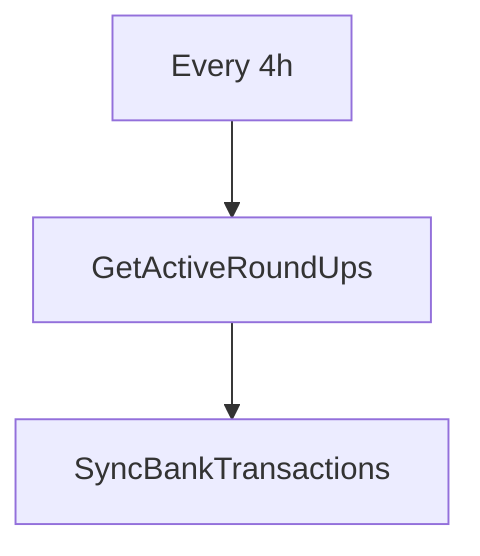
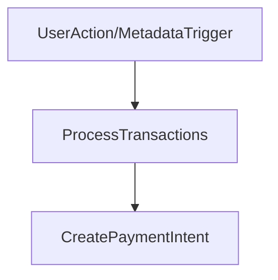
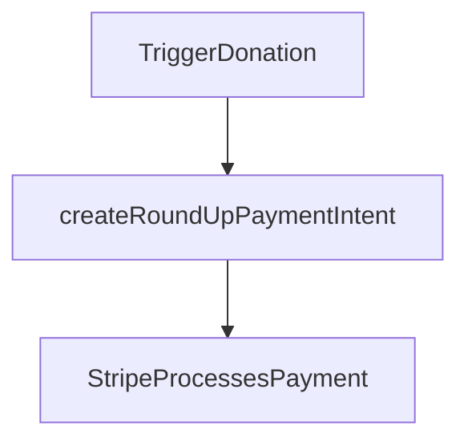
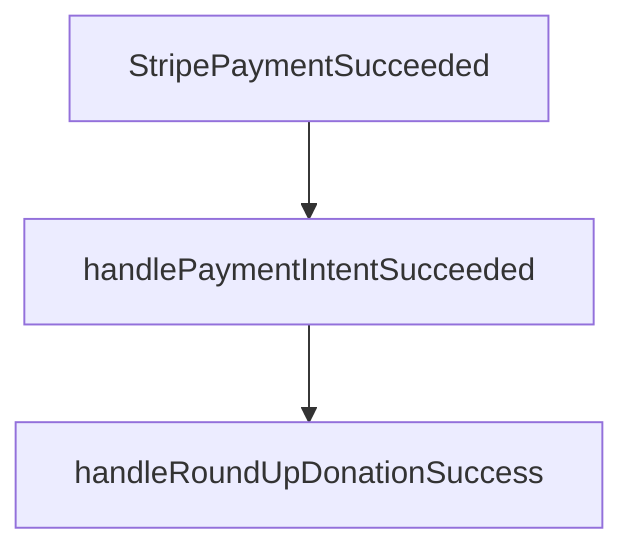
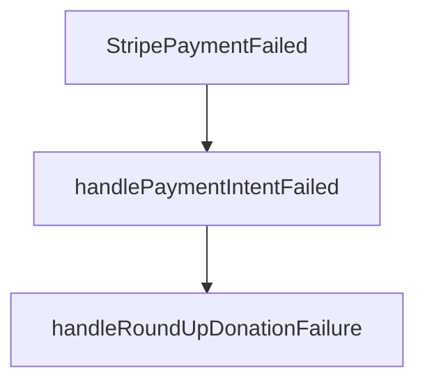

# Complete Donation Completion Flow Analysis

## 🔍 Overview

The RoundUp donation system uses **webhook-based payment processing** instead of immediate donation creation. This ensures payment reliability, proper error handling, and comprehensive audit trails.

## 🚀 Complete Donation Journey

### **1. Trigger Point: Cron Job Sync (Every 4 Hours)**



```javascript
// In roundUpTransactions.job.ts
const startRoundUpProcessingCron = () => {
  // Run every 4 hours to check for new transactions
  const schedule = '0 */4 * * * *';
  
  const activeRoundUpConfigs = await RoundUpModel.find({
    isActive: true,
    enabled: true,
    bankConnection: { $ne: null },
  });
  
  // Process each user's transactions
  for(const roundUpConfig of activeRoundUpConfigs) {
    await roundUpService.syncTransactions(userId, bankConnectionId, { cursor: null });
  }
}
```

### **2. Transaction Processing (Manual or Threshold-Based)**



#### **A. Manual User Trigger:**
```javascript
// In roundUp.service.ts - processMonthlyDonation
const processMonthlyDonation = async (userId: string, payload: any) => {
  const roundUpConfig = await RoundUpModel.findOne({
    roundUpId,
    user: userId,
    isActive: true,
  });
  
  // Get processed transactions for current month
  const processedTransactions = await getTransactions({
    user: userId,
    bankConnection: roundUpConfig.bankConnection,
  });
  
  // Call webhook-based trigger
  await triggerDonation(roundUpConfig);
}
```

#### **B. Automatic Threshold Trigger (via Transaction Processing):**
```javascript
// In roundUpTransaction.service.ts - triggerDonation
const triggerDonation = async (roundUpConfig: IRoundUpDocument) => {
  // Get pending transactions for current month
  const pendingTransactions = await RoundUpTransactionModel.find({
    user: roundUpConfig.user,
    bankConnection: roundUpConfig.bankConnection,
    status: 'processed',
    transactionDate: { 
      $gte: startDate, 
      $lt: endDate 
    },
  });
  
  // Calculate total amount and create payment intent
  const totalAmount = pendingTransactions.reduce(
    (sum, transaction) => sum + transaction.roundUpAmount,
    0
  );
  
  const paymentIntentResult = await StripeService.createRoundUpPaymentIntent({
    roundUpId: String(roundUpConfig._id),
    userId: roundUpConfig.user,
    charityId: roundUpConfig.organization,
    causeId: roundUpConfig.cause,
    amount: totalAmount,
    // ... metadata
  });
  
  // Update status and save
  await RoundUpTransactionModel.updateMany(
    { _id: { $in: pendingTransactions.map((t) => t._id) } },
    { status: 'processing', stripePaymentIntentId: paymentIntentResult.payment_intent_id }
  );
}
```

### **3. Stripe Payment Intent Creation**



```javascript
// In stripe.service.ts - createRoundUpPaymentIntent
const createRoundUpPaymentIntent = async (payload) => {
  // Get charity's Stripe Connect account
  const charity = await OrganizationModel.findById(payload.charityId);
  
  // Create Stripe Payment Intent
  const paymentIntent = await stripe.paymentIntents.create({
    amount: Math.round(payload.amount * 100),
    currency: 'usd',
    metadata: {
      roundUpId: payload.roundUpId,
      userId: payload.userId,
      organizationId: payload.charityId,
      type: 'roundup_donation',
      donationType: 'roundup',
      // ... webhook tracking fields
    },
    transfer_data: {
      destination: charity.stripeConnectAccountId,
    }
  });
  
  return { client_secret: paymentIntent.client_secret, payment_intent_id: paymentIntent.id };
}
```

### **4. Webhook Processing (Payment Success)**



```javascript
// In donation/webhook.handler.ts - handleRoundUpDonationSuccess
const handleRoundUpDonationSuccess = async (roundUpId: string, paymentIntentId: string) => {
  // Get configuration and processing transactions
  const roundUpConfig = await RoundUpModel.findById(roundUpId);
  const processingTransactions = await RoundUpTransactionModel.find({
    user: roundUpConfig.user,
    bankConnection: roundUpConfig.bankConnection,
    status: 'processing',
    stripePaymentIntentId: paymentIntentId,
  });
  
  // Create main donation record in Donation model
  const totalAmount = processingTransactions.reduce(
    (sum, transaction) => sum + transaction.roundUpAmount, 0
  );
  
  const donationRecord = await Donation.create({
    donor: roundUpConfig.user,
    organization: roundUpConfig.organization,
    cause: roundUpConfig.cause,
    donationType: 'round-up',
    amount: totalAmount,
    currency: 'USD',
    status: 'completed',
    donationDate: new Date(),
    stripePaymentIntentId: paymentIntentId,
    // ... fields
  });
  
  // Reset and pause round-up configuration
  roundUpConfig.currentMonthTotal = 0;
  roundUpConfig.lastMonthReset = new Date();
  roundUpConfig.enabled = false;
  roundUpConfig.status = 'completed';
  roundUpConfig.lastSuccessfulDonation = new Date();
  await roundUpConfig.save();
  
  // Mark transactions as donated
  await RoundUpTransactionModel.updateMany(
    { _id: { $in: processingTransactions.map((t) => t._id) } },
    { status: 'donated', donatedAt: new Date() }
  );
}
```

### **5. Webhook Processing (Payment Failure)**



```javascript
// In donation/webhook.handler.ts - handleRoundUpDonationFailure
const handleRoundUpDonationFailure = async (roundUpId: string, paymentIntentId: string) => {
  // Rollback transactions to processed state for retry
  await RoundUpTransactionModel.updateMany(
    {
      user: roundUpConfig.user,
      bankConnection: roundUpConfig.bankConnection,
      status: 'processing',
      stripePaymentIntentId: paymentIntentId,
    },
    {
      status: 'processed', // Back to ready state
      stripePaymentIntentId: undefined,
      lastPaymentFailure: new Date(),
      lastPaymentFailureReason: errorMessage,
    }
  );
  
  // Reset configuration for retry
  roundUpConfig.status = 'active';
  roundUpConfig.lastDonationAttempt = new Date();
  roundUpConfig.lastDonationFailure = new Date();
  roundUpConfig.lastDonationFailureReason = errorMessage;
  await roundUpConfig.save();
}
```

## 🔄 State Flow Summary

### **Transaction Status Lifecycle:**

```mermaid
graph LR
    A[Pending] --> B[Processed] --> C[Processing] --> D[Donated]/E[Failed]
    A --> B: Transaction detected from bank
    B --> C: Threshold met / Manual trigger
    C --> D: Payment intent created, awaiting webhook
    D --> E: Webhook confirms success
    C --> F: Payment failed, rollback for retry
```

### **RoundUp Configuration Lifecycle:**

```mermaid
graph TD
    X[Active] --> Y[Processing] --> Z[Completed] --> A[Paused]
    X --> Y: Donation created via webhook
    Y --> Z: Donation completed successfully
    Z --> A: System pauses to prevent double-donation
    A --> X: User can resume for next cycle
```

### **Payment Processing States:**

```mermaid
graph TB
    Start --> Intent Created --> Processing --> Success --> Complete
    Start --> Intent Created --> Processing --> Failed --> Rollback --> Ready
                                    Start --> Intent Created --> Processing --> Canceled --> Rollback --> Ready
```

## 🎯 Key Integration Points

### **1. Stripe Integration**

#### **Payment Intent Creation:**
- **Endpoint**: `POST /v1/payment_intents`
- **Transfer Data**: Direct to charity's Connect account
- **Metadata**: Complete tracking (user_id, roundup_id, organization_id, etc.)
- **Webhook Events**: `payment_intent.succeeded`, `payment_intent.payment_failed`

#### **Webhook Architecture:**
- **Inbound**: Stripe → Your webhook endpoint → Verification → Processing
- **Outbound**: Processing → Status updates → Database updates → Logs
- **Security**: Signature verification with webhook secret

### **2. Database Layer**

#### **RoundUpTransaction Model:**
```javascript
{
  status: 'pending|processed|processing|donated|failed',
  stripePaymentIntentId: String, // Links to Stripe payment
  donationAttemptedAt: Date,
  donatedAt: Date,
  lastPaymentFailure: Date,
  lastPaymentFailureReason: String,
  // ... other fields
}
```

#### **RoundUp Model:**
```javascript
{
  status: 'pending|processing|completed|cancelled|failed',
  lastDonationAttempt: Date,
  lastSuccessfulDonation: Date,
  lastDonationFailure: Date,
  lastDonationFailureReason: String,
  // ... webhook tracking fields
}
```

#### **Donation Model:**
```javascript
{
  donationType: 'round-up',
  stripePaymentIntentId: String,
  status: 'completed|processing|failed',
  roundUpId: String, // Links to RoundUp config
  // ... donation fields
}
```

### **3. Error Handling & Retry Logic**

#### **Payment Intent Failures:**
- **Immediate Rollback**: Transactions go back to 'processed' state
- **Retry Possibility**: Users can retry via manual trigger or next cycle
- **Error Tracking**: Detailed failure reasons saved for debugging

#### **Webhook Timing Issues:**
- **Delayed Confirmation**: Transactions stay in 'processing' state
- **Missing Webhooks**: System can be configured for retries
- **Partial Success**: Some transactions may succeed, others fail individually

## 🔍 Benefits of Webhook-Based System

### **1. Payment Reliability**
- **Confirmation Required**: Payments only complete after webhook confirmation
- **No Assumptions**: Don't mark as 'donated' until money is actually received
- **Bank-Level Security**: Uses Stripe Connect for direct charity payouts

### **2. Transaction Integrity**
- **Idempotency Support**: Duplicate payment intents handled gracefully
- **Status Consistency**: Clear state transitions with audit trail
- **Rollback Capability**: Failed transactions can be retried cleanly

### **3. **Monitoring & Debugging**
- **Real-time Status**: Monitor 'processing' transactions
- **Detailed Logging**: Complete transaction and payment intent history
- **Error Analysis**: Detailed failure reasons and retry patterns

### **4. **Administrative Control**
- **Admin Monitoring**: View processing transactions across all users
- **Manual Intervention**: Retry failed transactions or debug issues
- **Statistics**: Success rates, processing times, failure patterns

## ⚡ Comparison: Webhook vs Immediate

### **Before (Immediate Processing):**
```javascript
// ❌ PROBLEMATIC APPROACH
await StripeService.processRoundUpDonation(payload); // Immediate processing
await RoundUpModel.updateMany(... 'donated'); // Mark as complete

Issues:
- ❌ Payment might fail but transaction marked 'completed'
- ❌ No way to know actual payment status
- ❌ Limited retry options
- ❌ No audit trail for troubleshooting
```

### **After (Webhook-Based):**
```javascript
// ✅ RELIABLE APPROACH
const paymentIntent = await StripeService.createRoundUpPaymentIntent(payload); // Create intent first
await RoundUpTransactionModel.updateMany('processing'); // Mark as processing
// Later via webhook...
await Donation.create({...}); // Payment confirmed
await RoundUpTransactionModel.updateMany('donated'); // Complete

Benefits:
- ✅ Confirmation Required: No success until webhook received
- ✅ Proper rollback: Failed payments automatically roll back
- ✅ Full Audit Trail: Complete payment timing data
- ✅ Retry Logic: Failed payments can be retried multiple times
```

## 🎯 Complete Success Scenario

### **Step-by-Step Flow:**
1. **Sync**: `08:00 AM` - Cron job syncs transactions
2. **Calculate**: System calculates $3.75 round-up amount for 5 transactions
3. **Trigger**: Threshold $10 met → Payment intent created (`pi_123...`)
4. **Process**: Transactions marked `'processing'`
5. **Charge**: Stripe processes payment → `$3.75` → Charity account
6. **Webhook**: Stripe sends `payment_intent.succeeded`
7. **Success**: Webhook handler processes success
8. **Create**: Main donation record in `Donation` model
9. **Complete**: Transaction status changed to `'donated'`
10. **Pause**: RoundUp configuration paused for user

### **Timeline Example:**
```mermaid
gantt
    title RoundUp Donation Completion Webhook Flow
    section Initialization
    option 8:00 AM Cron Job Sync
    section 10:15 AM Transaction Detected ($4.25 coffee)
    option 10:16 AM Transaction Detected ($2.50 groceries)
    option 10:18 AM Transaction Detected ($6.75 gas)
    option 10:20 AM Threshold Reached ($10.75 total)
    option Payment Intent Created: pi_123abc456 at 10:20:01 AM
    option Stripe Processing: 10:20:02 AM
    option Webhook Received: 10:20:15 AM
    option Donation Recorded: 10:20:16 AM
    option RoundUp Paused: 10:20:17 AM
    section End Cycle
```

## 📊 Monitoring & Administrative Views

### **User Dashboard:**
- **Current Status**: Shows total donations this month
- **Recent Activity**: Processed vs donated transactions count
- **Processing State**: Currently waiting for webhook confirmation
- **Actions**: Manual triggers, pause/resume capabilities

### **Admin Dashboard:**
- **System Health**: Overall success rates and processing times
- **Monitoring**: Real-time processing transactions across all users
- **Troubleshooting**: Failed transactions and retry opportunities

### **API Endpoints for Monitoring:**
```javascript
// Monitor transactions currently awaiting webhook
GET /roundup-transactions/admin/processing

// Get detailed transaction analysis for date ranges
GET /roundup-transactions/admin/eligible?startDate=2024-01-01&endDate=2024-12-31

// Manually trigger failed transactions for retry
POST /roundup-transactions/admin/retry-failed
```

## ✅ Key Success Indicators

### **1. Payment Success**
- ✅ Stripe payment intent created successfully
- ✅ `payment_intent.succeeded` webhook received
- ✅ Donation record created in main `Donation` model
- ✅ Transaction status updated to `'donated'`
- ✅ RoundUp configuration properly paused

### **2. Data Integrity**
- ✅ Financial data matches (amount, dates, IDs)
- ✅ Status transitions are consistent and atomic
- ✅ All relationships maintained (user → organization → cause → donation)
- ✅ Webhook tracking data complete

### **3. System Health**
- ✅ No orphaned transactions (all have clear status)
- ✅ No duplicate donations (idempotent transaction handling)
- ✅ Clear audit trail for compliance
- ✅ Error rates monitored and tracked

This webhook-based approach ensures every round-up donation is **verified, tracked, and reliable**, providing a much more robust donation system than immediate processing ever could. 🚀
